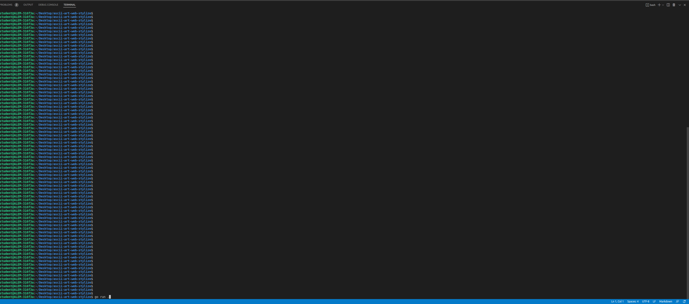

# Description: #
This project receives a string as an argument and outputs the string in a graphic representation using ASCII. And prints the output via three banners: standard, shadow and thinkertoy. Also, the user can choose the color of the output.

# Authors: #
@adletb
@meruyert.ts

# Usage: # 
-Run the program by typing go run . in the terminal

-Open the web browser and go to localhost:8080/

-Type the string inside the textbox and choose the banner and/or color of the output

-Click the Submit button

# Implementation Details: #
-The input string is passed to the printWord function, which adds each letter(in ascii) to the output string and returns it to splitWord function
